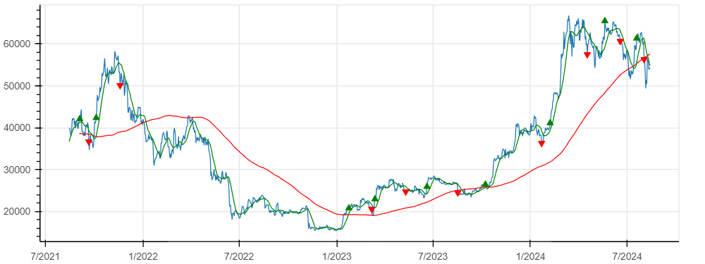
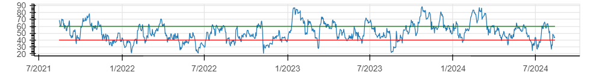
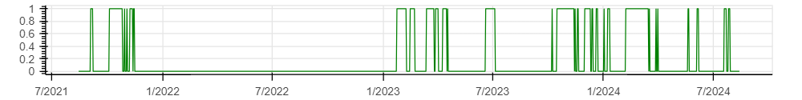
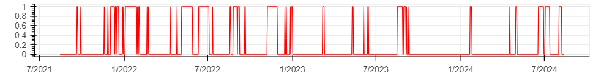
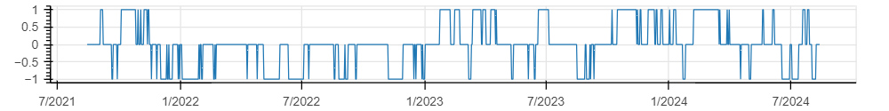
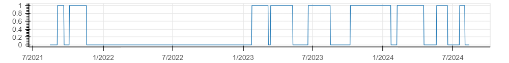
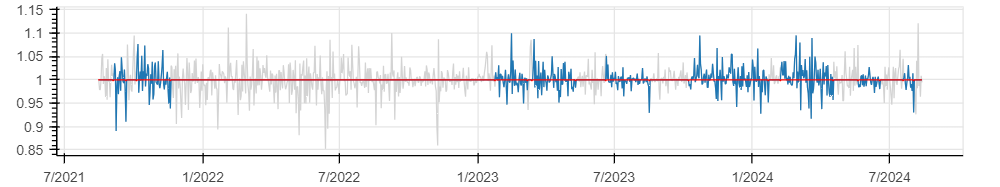

# (Kiss)backtest

_(Keep It Simple and Stupid) backtesting coded with Python_

## Disclamer

_Quod de futuris non est determinata omnino veritas._ [^1]

[^1]: "No truth can be determined with certainty about the future." Letter from Nostradamus to Henri II

## Install

### Install TALib

To take full advantage of all features (technical indicators), you have to install TALib.

```bash
sudo apt install -y build-essential wget
wget http://prdownloads.sourceforge.net/ta-lib/ta-lib-0.4.0-src.tar.gz
tar -xvf ta-lib-0.4.0-src.tar.gz
cd ta-lib
./configure --prefix=/usr
make
sudo make install
```

### Install Python Libraries

```bash
sudo pip3 install TA-Lib bokeh
```

### Load kissbacktest
```python
%load kissbacktest.py
```

## Use

### Download data

Request the latest 720 values from Kraken API:
```python
df = kbt_init('XXBTZEUR',1440) # 1d
```
or download [the .cvs file directly from Kraken.com](https://support.kraken.com/hc/en-us/articles/360047124832-Downloadable-historical-OHLCVT-Open-High-Low-Close-Volume-Trades-data) and read it:
```python
df = pd.read_csv('XXBTZEUR_14400.csv')
```

### Define signal from stategy

example:

$$
\begin{align}
    S_{in} &\equiv \bigl\( SMA_{14} > SMA_{200} \bigr\) \ \\&\  \bigl\( RSI_{14} > 60 \bigr\) \\
    S_{out} &\equiv \big\( RSI_{14} < 40 \big\)
\end{align}
$$

```python
df['RSI'] = ta.RSI(df.close, timeperiod=14)
df['slow'] = ta.SMA(df.close, timeperiod=200)
df['fast'] = ta.SMA(df.close,timeperiod=14)
df['sig_in'] = (df.RSI > 60) & (df.slow < df.fast)
df['sig_out'] = (df.RSI < 40)
```

### compute and trace graph

```python
df = kbt_compute (df)
kbt_graph(df)
```
## Result

$$ Price, SMA_{200}, SMA_{14} $$

<p align="center"></p>

$$ RSI_{14} $$

<p align="center"></p>

$$ SIG_{in} \equiv \bigl( SMA_{14} > SMA_{200} \bigr) \ \\&\  \bigl( RSI_{14} > 60 \bigr) $$

<p align="center"></p>

$$ SIG_{out} \equiv \big( RSI_{14} < 40 \big) $$

<p align="center"></p>

$$ SIG_0 \equiv SIG_{in} - SIG_{out} $$

<p align="center"></p>

$$
SIG_1(t_n) = 
\begin{cases} 
SIG_0(t_n) & \quad \textrm{if } SIG_0(t_n) \ne 0 \\
SIG_0(t_{n-1}) & \quad \textrm{otherwise}
\end{cases} 
$$

$$ POS \equiv SIG_1 > 0 $$

<p align="center"></p>

$$ r_{HODL}(t_n) = { Prix(t_n)\over Prix(t_{n-1}) } $$

$$ r_{strat}(t) = \begin{cases} 
r_{HODL}(t_n) & \quad \textrm{if } POS(t_{n-1}) = 1 \\
1 & \quad \textrm{otherwise} 
\end{cases} $$

$$ r_{fee}(t_n) = 
\begin{cases} 
1-fee & \quad \text{if } POS(t_{n-1}) \neq  POS(t_n) \\
1 & \quad \text{otherwise}
\end{cases} $$

<p align="center"></p>

$$ R_{netto}(t_n) = \prod^n_{i=1} \biggl( r_{strat}(t_i) \times r_{fee}(t_i) \bigg) $$

<p align="center"></p>
